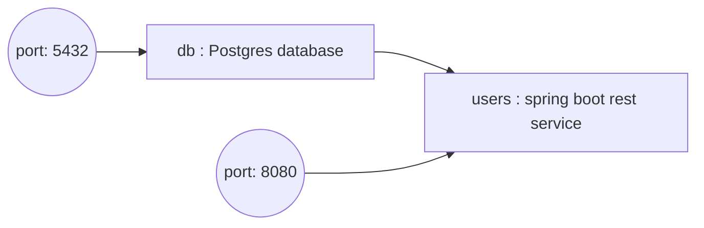

# Springboot user service
A rest service for maintaining users in a postgres database. A docker compose file that has the following services :
- **users** : the springboot application for the userservice 
- **db**    : a postgres database with a users table

## Starting the service

Ensure your local docker is running.

Go to the root folder of the project (_where the docker-compose file is_) and type :
```shell
./mvnw install && \
docker compose build && \ 
docker compose up
```
## Checking the service works
After starting the service ensure the service is up and running with your favourite http client. I use httpie. Go to a command terminal and type in:
```shell
http :8080/actuator/health
```

You should then see something like :

```json
HTTP/1.1 200
Connection: keep-alive
Content-Type: application/vnd.spring-boot.actuator.v3+json
Date: Sun, 27 Aug 2023 13:01:14 GMT
Keep-Alive: timeout=60
Transfer-Encoding: chunked
{
  "components": {
    "db": {
      "details": {
        "database": "PostgreSQL",
        "validationQuery": "isValid()"
      },
      "status": "UP"
    },
    "diskSpace": {
      "details": {
        "exists": true,
        "free": 394731638784,
        "path": "/Users/marcusblackhall/IdeaProjects/userservice/.",
        "threshold": 10485760,
        "total": 494384795648
      },
      "status": "UP"
    },
    "ping": {
      "status": "UP"
    }
  },
  "status": "UP"
}
```
## Using the service

All of the terminal commands below use httpie. If you want to know how that works go to the site [httpie](https://httpie.io)
### Add a user

```shell
http POST :8080/users name="Your user name" email="Your email"
```

### List Users
```shell
http :8080/users
```

### Delete a User
```shell
http DELETE :8080/users/1
```
## Stopping the service
```shell
docker compose down
```

